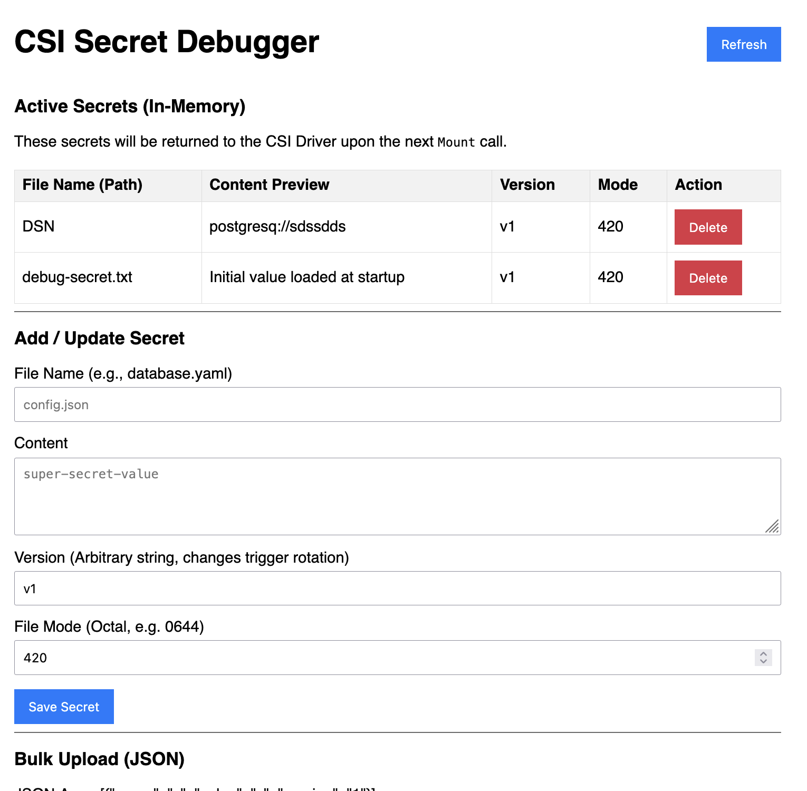

# CSI Secret Debugger

A Container Storage Interface (CSI) driver designed for debugging and testing secret storage workflows in Kubernetes.



## Overview

The CSI Secret Debugger is a specialized CSI driver that helps developers debug and test secret storage implementations. It provides visibility into how secrets are mounted, accessed, and managed within Kubernetes pods through CSI volumes.

## Features

- **Secret Mount Debugging**: Monitor and log how secrets are mounted into pods via CSI volumes
- **Storage Workflow Testing**: Validate secret persistence and lifecycle management
- **Flexible Configuration**: Support for various secret storage backends
- **Comprehensive Logging**: Detailed logs for troubleshooting secret mount issues

## Use Cases

- **Development & Testing**: Validate secret storage implementations before production deployment
- **Troubleshooting**: Diagnose issues with secret mounting in Kubernetes clusters
- **Education**: Understand how CSI drivers interact with secret storage systems
- **Integration Testing**: Verify secret storage behavior across different Kubernetes versions

## Quick Start

## Installation

```bash
# Deploy the CSI driver to your cluster
kubectl apply -f deploy/
```

### Building from Source

```bash
go build -o csi-debugger 
```

## Usage Example

Here's a complete example of using the CSI Debugger to mount secrets into a pod:

### 1. Create a SecretProviderClass

```yaml
apiVersion: secrets-store.csi.x-k8s.io/v1
kind: SecretProviderClass
metadata:
  name: csi-debugger-spc
  namespace: default
spec:
  provider: csidebugger
  parameters:
    debug: "true"
```

### 2. Deploy a Pod with Secrets

```yaml
apiVersion: v1
kind: Pod
metadata:
  name: secret-test-pod
  namespace: default
spec:
  containers:
  - name: test-container
    image: busybox:1.36
    command: ["sh", "-c", "sleep 3600"]
    volumeMounts:
    - name: secrets-volume
      mountPath: /mnt/secrets
      readOnly: true
  volumes:
  - name: secrets-volume
    csi:
      driver: secrets-store.csi.k8s.io
      readOnly: true
      volumeAttributes:
        secretProviderClass: csi-debugger-spc
```

### 3. Add Secrets via the Admin UI

Once the driver is deployed, you can add secrets through the HTTP admin interface:

```bash
# Port-forward to access the admin UI
kubectl port-forward -n kube-system svc/csi-driver-admin 8090:8090
```

Then open http://localhost:8090 in your browser and add secrets. Any secrets you add will be mounted into pods using the `csi-debugger-spc` SecretProviderClass.

### 4. Verify Secrets in the Pod

```bash
# Check what files are mounted
kubectl exec secret-test-pod -- ls -la /mnt/secrets

# Read a secret file
kubectl exec secret-test-pod -- cat /mnt/secrets/my-secret.txt
```

## Configuration

The driver can be configured through command-line flags:

- `--endpoint`: CSI socket endpoint (default: `unix:///csi/csi.sock`)
- `--nodeid`: Node ID for the driver instance
- `--driver-name`: CSI driver name (default: `csidebugger`)

## E2E Testing

The project includes comprehensive end-to-end tests to validate secret storage workflows:

```sh
cd e2e
go test -v -tags e2e -timeout 20m

# to skip the teardown
SKIP_TEARDOWN=true go test -v -tags e2e -timeout 20m

# to reach the UI
kubectl port-forward -n kube-system svc/csi-driver-admin 8090:8090
```

### What the E2E Test Does

*   **Provider Registration**: Deploys the CSI debugger provider and ensures it's correctly registered with the secrets-store-csi-driver.
*   **Secret Mounting**: Creates a SecretProviderClass and deploys a pod with a CSI volume mount to validate secrets are correctly mounted.
*   **End-to-End Validation**: Uses the admin API to add secrets, then verifies they are accessible from within the mounted pod.
*   **Resource Cleanup**: Uses `defer` to clean up resources, ensuring your cluster is ready for the next test run even if this one fails.


